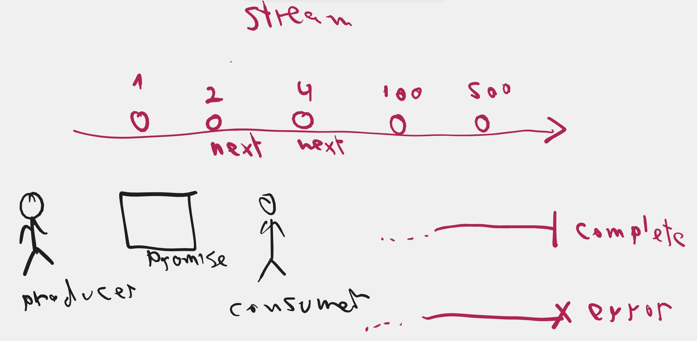
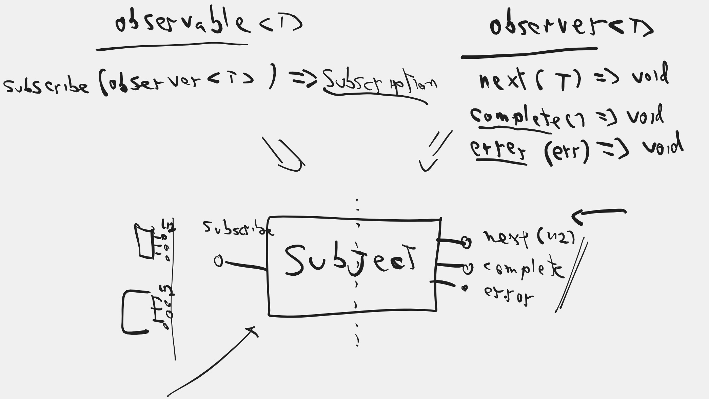
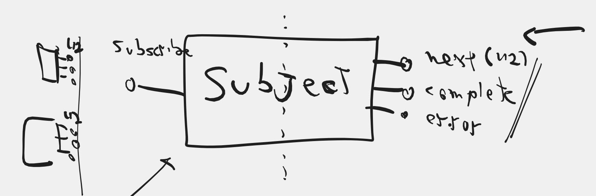
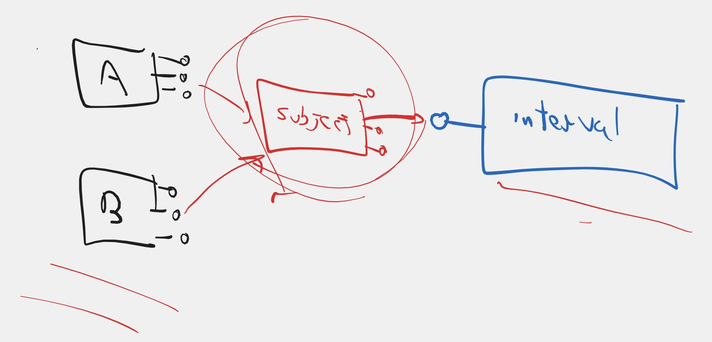
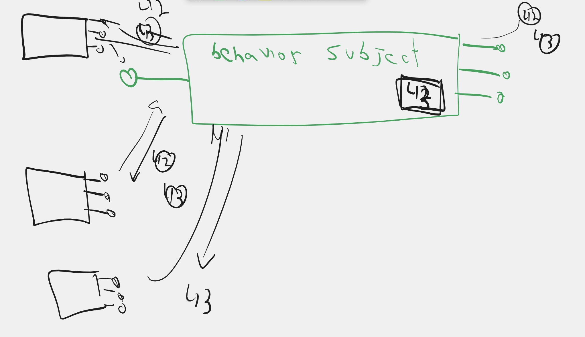

## Module 06 - RxJS, 
### Projects:
|     |     |
| --- | --- |
| [fun-with-rxjs](./projects/fun-with-rxjs/) | Introduction to rxjs main classes and concepts |

### Introduction to RxJS
* We understood the meaning of a `Stream`

* We defined what an `Observer<T>` is and understood that it has 3 methods
    * `next(T)`
    * `complete()`
    * `error(err)`
* We understood that `Observable<T>` is an object that allows observers to subscribe
    * `subscribe(Observer<T>)`

* We saw how to define an observer explicitly by supplying the 3 methods and their implementation
* We saw how to create an observable using the `interval` operator
* We saw that 2 observers that subscribe on different times, get different sets of events that are not synchronized
* We understoof the difference between **cold** observables and **hot** observables
* We have seen a few other factory operators:
  * `timer` - creates an observable with time delay. It has two variations
    * `timer(----)`=>  ----0|
    * `timer(----, --)` => ----0--1--2--3--4...
  * `of` - wraps a value or values inside a synchronous observable
    * `of(42)` => (42)|
    * `of(1, 2, 3)` => 123|
  * `from` - serves as a multifunction converter between any wrapper to observable
    * `from([1, 2, 3])` => [1, 2, 3]|
    * `from(Promise ----42|)` => ----42|
* We saw how to create a custom observable using the observable constructor
* We got familiar with the `Subject` object and understood that it is a hot observable

* We saw that a subject can be used as a proxy to "heat" a cold observable

* We learned about `BehaviorSubject` and understood that it is just a subject that sends the latest event to a new observer on the moment of subscription

